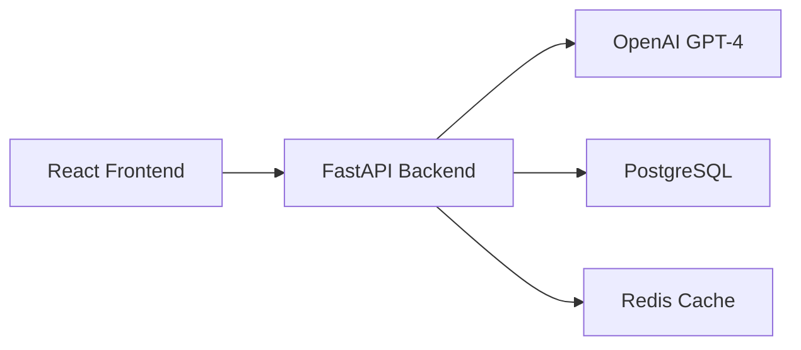

# NeuraLint: AI-Powered Code Analysis Platform 🧠

[](https://www.typescriptlang.org/)
[](https://reactjs.org/)
[](https://www.python.org/)
[](https://fastapi.tiangolo.com/)
[](LICENSE)

<div align="center">
  
</div>

## 🚀 Features

NeuraLint is a cutting-edge code analysis platform that leverages artificial intelligence to provide comprehensive code reviews and suggestions. It helps developers write better, more secure, and more performant code.

### Key Features

- 🔍 **Real-time Code Analysis**
  - Instant feedback on code quality
  - Support for multiple programming languages
  - AI-powered suggestions for improvements

- 🛡️ **Security Scanning**
  - Detection of common vulnerabilities (XSS, SQL Injection, etc.)
  - OWASP Top 10 compliance checks
  - CWE mapping for identified issues

- ⚡ **Performance Optimization**
  - Identification of performance bottlenecks
  - Resource usage analysis
  - Optimization suggestions with estimated improvements

- 📚 **Best Practices**
  - Language-specific recommendations
  - Industry-standard coding patterns
  - Automated style guide enforcement

## 🛠️ Technology Stack

### Frontend
- **React 18** with TypeScript for robust type safety
- **Tailwind CSS** for modern, responsive design
- **Vite** for lightning-fast development experience
- **React Router** for seamless navigation
- **Axios** for API communication
- **Lucide React** for beautiful icons

### Backend
- **FastAPI** for high-performance API endpoints
- **SQLAlchemy** for database operations
- **OpenAI GPT-4** integration for AI analysis
- **PostgreSQL** for reliable data storage
- **Redis** for caching and performance

## 🏗️ Architecture



## 🚀 Getting Started

1. **Clone the repository**
   ```bash
   git clone https://github.com/yourusername/neuralint.git
   cd neuralint
   ```

2. **Install dependencies**
   ```bash
   # Frontend
   npm install

   # Backend
   python -m pip install -r backend/requirements.txt
   ```

3. **Set up environment variables**
   ```bash
   # Create .env file in backend directory
   cp backend/.env.example backend/.env
   # Add your OpenAI API key and other credentials
   ```

4. **Start the development servers**
   ```bash
   # Frontend
   npm run dev

   # Backend
   npm run backend:dev
   ```

## 🌟 Key Features Implementation

### AI-Powered Analysis
```typescript
// Example of AI integration for code analysis
const analyzeCode = async (code: string, language: string): Promise<CodeAnalysisResult> => {
  const response = await axios.post('/api/analyze', { code, language });
  return response.data;
};
```

### Real-time Security Scanning
```python
class SecurityScanner:
    def scan(self, code: str, language: str) -> List[SecurityIssue]:
        # Advanced security vulnerability detection
        return self.detect_vulnerabilities(code)
```

## 📊 Performance Metrics

- **Frontend Performance**
  - First Contentful Paint: < 1.5s
  - Time to Interactive: < 2s
  - Lighthouse Score: > 90

- **Backend Performance**
  - Average Response Time: < 200ms
  - Concurrent Users Supported: 1000+
  - Analysis Time: < 3s

## 🤝 Contributing

Contributions are welcome! Please read our [Contributing Guidelines](CONTRIBUTING.md) for details on our code of conduct and the process for submitting pull requests.

## 📝 Code Quality Standards

- 100% TypeScript coverage
- Comprehensive unit tests
- ESLint + Prettier configuration
- Automated CI/CD pipeline
- Code review requirements

## 📄 License

This project is licensed under the MIT License .

## 👨‍💻 Author

Created by [Mrityunjay Dwivedi]


---

<div align="center">
  <strong>Built with ❤️ using React, FastAPI, and AI</strong>
</div>
